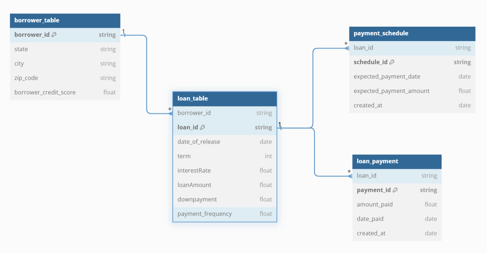
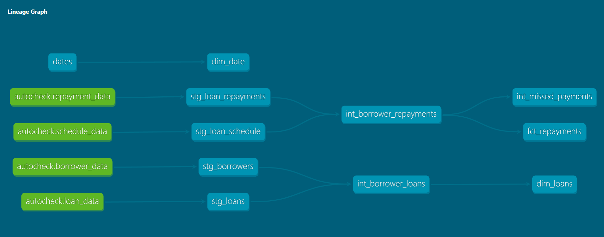

# autochek-data-model

### This repo is dedicated to the development of autochek data pipeline design, modeling and web crawler of car listings

## ETL Pipeline design and data modeling

### **ERD of Data Sources**

The diagram above shows the logical representation of autochek data sources

An EL scripts was designed in python to pull the source files (csv sources) and load the raw data into a snowflake warehouse. Leveraging on this, dbt core was implemented to perform data transformation and modeling on the raw data within Snowflake in order to statisfy business analytics and answer specific business questions.

A script was used within Snowflake to setup the warehouse for this project. The script can be found here: scripts/snowflake_setup.sql.

### **Data Modeling**

The modeling part of this project is broken down into three layers:

- Staging: This phase is basically to extract the specific part of the data that is needed from the raw schema, apply some basic transformations like type casting, and denormalization where necessary. The models in this layer are materialized as views.
- Intermediate: Major transformations happen at this layer, transformations that involves doing any calculations, performing joins, window functions etc. The models at this layer are materialized as tables.
- Marts: This layer is the final layer in the modeling life cycle. It contains the final data product that data analysts, scientists, ML engineers will leverage on. This layer is majorly dependent on the downstream layer - Intermediate.

### **Data Lineage**

The full data model documentation and lineage can be found on this GutHub page [here](https://ability014.github.io/autochek-data-model/).

## Web Crawler for Car Listings

A web crawler was degined to pull data from [cars45](https://cars45.com) website. This crawler pulls the image source, car brand, car amount, region, car type (foreign or local used) and other details. These information is loaded into snowflake incrementally and scheduled to run daily.

The data gotten with this crawler is stored in a separate schema in Snowflake (car_listing).

### **Dependencies**

The dependencies for this data project were python libraries needed to successfully run the python scripts and the snowflake credential to load the data into the warehouse. The python library dependencies were included as part of the github workflow.

In order to ensure credential security, all credential details were stored as github secrets.

### Prerequisites

- A GitHub account
- A snowflake account is needed for a replication of this project
